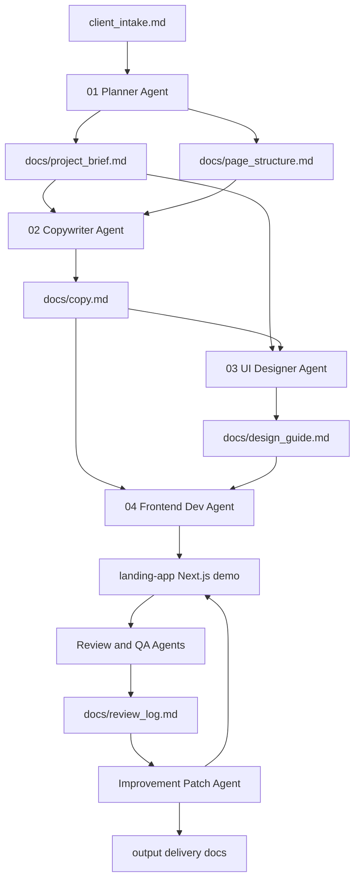
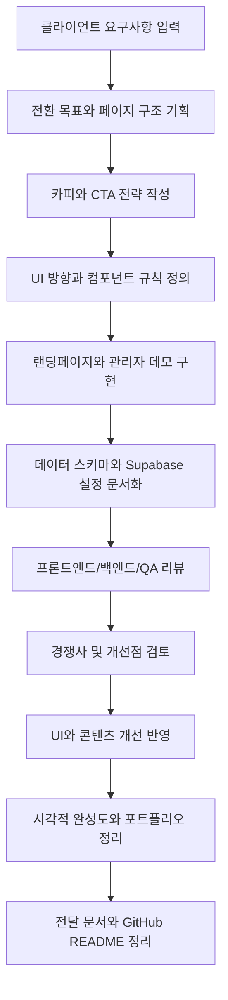
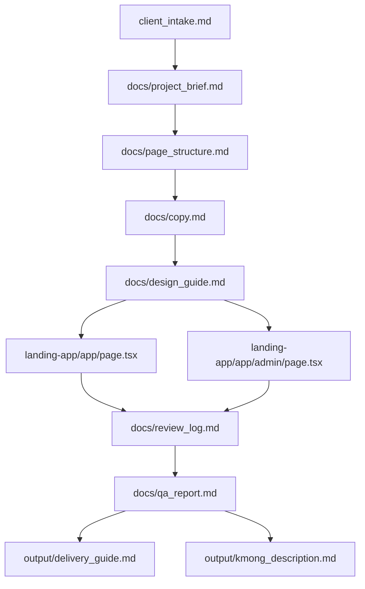
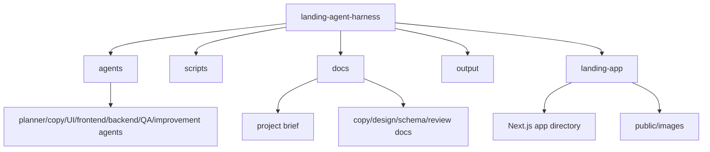

# Landing Agent Harness

랜딩페이지 프로젝트를 기획, 구현, 검토, 개선, 포트폴리오 정리까지 반복 가능한 절차로 진행하기 위한 에이전트 워크플로우 하네스입니다.

이 저장소는 단일 랜딩페이지 코드만 담은 프로젝트가 아닙니다. 역할별 에이전트 프롬프트, 기획 문서, 카피 문서, 디자인 가이드, 리뷰 체크리스트, 생성된 Next.js 예시 앱을 함께 묶어 랜딩페이지 제작 과정을 구조화합니다.

> 현재 상태: 로컬 워크플로우 템플릿과 생성된 데모 앱이 포함되어 있습니다. `landing-app/`은 장기렌트/리스 상담 랜딩페이지와 관리자 화면 예시입니다. 실제 운영에 필요한 관리자 인증, 권한 분리, 엄격한 보안 정책은 아직 완료된 기능이 아니며 **Future Work**입니다.

## Overview

Landing Agent Harness는 랜딩페이지 제작을 다음 단계로 나누어 관리합니다.

- 클라이언트 요구사항 정리
- 전환 목표와 페이지 구조 기획
- 랜딩페이지 카피 작성
- UI/디자인 방향 정의
- Next.js 기반 랜딩페이지 구현
- 프론트엔드, 백엔드, QA, 개선 리뷰
- GitHub 포트폴리오용 문서 정리

각 에이전트는 이전 단계의 산출물을 읽고, 다음 단계에서 사용할 명확한 문서를 생성하도록 설계되어 있습니다.

## Motivation

랜딩페이지는 기획, 카피, 디자인, 구현, QA가 섞이면 결과물이 쉽게 산만해집니다. 이 하네스는 작업을 역할별로 나누어 한 번 만든 프로젝트를 체계적으로 리뷰하고 개선할 수 있게 만드는 것을 목표로 합니다.

## Key Features

- `agents/` 폴더의 역할별 에이전트 지시문
- `scripts/` 폴더의 단계별 실행 프롬프트
- `docs/` 폴더의 기획, 카피, 디자인, DB, QA, 리뷰 문서
- `landing-app/` 폴더의 Next.js 랜딩페이지 예시
- 리드 수집 흐름을 위한 Supabase 스키마와 설정 문서
- UI/콘텐츠 반복 개선을 위한 리뷰 단계
- 포트폴리오 제출과 설명을 위한 `output/` 문서
- 워크플로우 문서와 생성된 앱 구현의 분리

## Architecture



## Agent Workflow



## Data Structure



## Directory Structure

```text
.
├── agents/              # 역할별 에이전트 지시문
├── scripts/             # 단계별 실행 프롬프트
├── docs/                # 기획, 카피, 디자인, 스키마, QA, 리뷰 문서
├── templates/           # 향후 재사용 템플릿 위치
├── output/              # 전달 가이드와 포트폴리오 설명 문서
├── landing-app/         # 생성된 Next.js 예시 앱
├── client_intake.md     # 시작 요구사항 문서
├── project_brief.md     # 루트 레벨 임시 기획 문서
├── README.md            # 영어 README
└── README.ko.md         # 한국어 README
```



## Tech Stack

하네스:

- Markdown 기반 에이전트 프롬프트
- Markdown 기반 프로젝트 산출물과 리뷰 로그
- Mermaid 기반 워크플로우 다이어그램

생성된 예시 앱:

- Next.js
- React
- TypeScript
- Tailwind CSS
- Supabase 클라이언트 패턴

## Usage

저장소 루트에서 하네스를 사용합니다.

```powershell
cd landing-agent-harness
```

권장 진행 순서:

1. `client_intake.md`를 작성하거나 수정합니다.
2. `agents/01_planner.md`의 플래너 프롬프트를 실행합니다.
3. 카피, UI, 프론트엔드, 백엔드, QA, 개선 프롬프트를 순서대로 사용합니다.
4. 각 단계의 결과를 대응되는 `docs/` 파일에 정리합니다.
5. `landing-app/`을 구현 작업 공간으로 사용합니다.
6. 포트폴리오 제출 전 `output/delivery_guide.md`를 확인합니다.

생성된 앱 실행:

```powershell
cd landing-app
npm install
npm run dev
```

로컬 확인 주소:

```text
http://localhost:3000
http://localhost:3000/admin
```

빌드 검증:

```powershell
npm run lint
npm run build
```

## Example Use Cases

- 클라이언트 요구사항 문서에서 랜딩페이지 제작 시작
- 러프한 서비스 아이디어를 구조화된 포트폴리오 프로젝트로 발전
- 카피, UI, 구현, QA를 분리해 단계별로 검토
- 리드 수집 랜딩페이지와 관리자 대시보드 데모 제작
- 여러 랜딩페이지 프로젝트에 같은 에이전트 순서 재사용

## Security / Privacy Notes

- 실제 클라이언트 데이터, 상담 리드 데이터, 인증정보, 토큰, 운영 Supabase 키를 커밋하지 않습니다.
- Supabase anon key는 RLS 정책이 안전하게 설계된 경우에만 공개 클라이언트에서 사용할 수 있습니다.
- service role key는 절대 클라이언트 코드나 공개 문서에 노출하면 안 됩니다.
- 포함된 관리자 화면은 실제 인증/권한 설계가 추가되기 전까지 포트폴리오 또는 데모 화면으로 보아야 합니다.
- 클라이언트 전달 전에는 사업자명, 연락처, 이미지, 정책 문구 등 placeholder를 실제 공개 가능한 정보로 교체해야 합니다.
- 비공개 URL, 로컬 절대경로, 개인 전화번호, 개인 이메일, 민감한 고객 요구사항은 문서에 넣지 않습니다.

이번 README 작성 과정에서는 실제 Supabase 프로젝트 URL, API 키, 토큰, service role key, 비공개 고객 데이터, 비공개 URL, 개인 연락처, 로컬 절대경로를 포함하지 않았습니다.

## Future Improvements

- **Planned:** 새 랜딩페이지 프로젝트를 빠르게 시작할 수 있는 클린 스타터 템플릿 추가
- **Planned:** 구현 전 필수 문서가 준비되었는지 확인하는 체크리스트 스크립트 추가
- **Planned:** 에이전트 리뷰 사이클용 issue/PR 템플릿 추가
- **Future Work:** 실제 운영 가능한 관리자 인증 가이드 추가
- **Future Work:** 운영 환경용 Supabase RLS 예시 강화
- **Future Work:** 시각적 회귀 테스트와 접근성 검사 자동화
