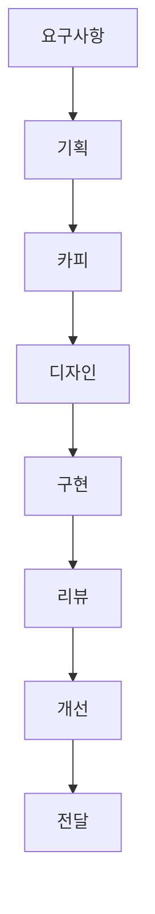
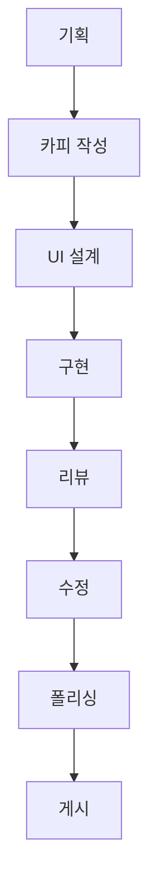
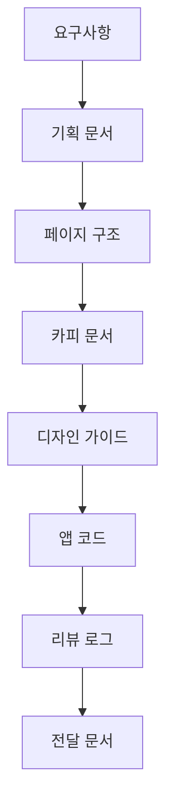
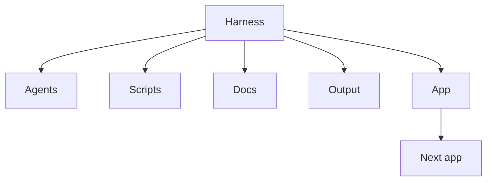

# Landing Agent Harness

랜딩페이지 프로젝트를 기획, 구현, 검토, 개선, 포트폴리오 정리까지 반복 가능한 절차로 진행하기 위한 에이전트 워크플로우 하네스입니다.

이 저장소는 단일 랜딩페이지 코드만 담은 프로젝트가 아닙니다. 역할별 에이전트 프롬프트, 기획 문서, 리뷰 체크리스트, 생성된 Next.js 예시 앱을 함께 묶어 랜딩페이지 제작 과정을 구조화합니다.

> 현재 상태: 로컬 워크플로우 템플릿과 생성된 데모 앱이 포함되어 있습니다. `landing-app`은 장기렌트/리스 상담 랜딩페이지와 관리자 화면 예시입니다. 실제 운영에 필요한 관리자 인증, 권한 분리, 배포 보안 검토는 아직 완료된 기능이 아니며 **Future Work**입니다.

## Overview

Landing Agent Harness는 랜딩페이지 제작을 단계별 에이전트 작업으로 나누어 관리합니다.

- 클라이언트 요구사항 정리
- 전환 목표와 페이지 구조 기획
- 랜딩페이지 카피 작성
- UI와 컴포넌트 방향 정의
- Next.js 기반 랜딩페이지 구현
- 프론트엔드, 백엔드, QA, 개선 리뷰
- GitHub 포트폴리오용 문서 정리

각 에이전트는 이전 단계의 산출물을 읽고 다음 단계에서 사용할 명확한 문서를 생성하도록 설계되어 있습니다.

## Motivation

랜딩페이지는 기획, 카피, 디자인, 구현, QA가 섞이면 결과물이 쉽게 산만해집니다. 이 하네스는 작업을 역할별로 분리해 프로젝트를 체계적으로 리뷰하고 개선할 수 있게 만드는 것을 목표로 합니다.

## Key Features

- 역할별 에이전트 지시문
- 단계별 실행 프롬프트
- 기획, 카피, 디자인, 스키마, QA, 리뷰, 전달 문서
- 생성된 Next.js 랜딩페이지 예시
- 리드 수집 흐름을 위한 Supabase 스키마와 설정 문서
- UI와 콘텐츠 반복 개선 단계
- 포트폴리오 제출용 문서
- 워크플로우 문서와 생성된 앱 구현의 분리

## Architecture



자세한 경로는 Directory Structure 섹션에 정리되어 있습니다.

## Agent Workflow



이 워크플로우는 랜딩페이지 제작을 반복 가능하게 만드는 데 초점을 둡니다. 기획, 구현, 리뷰, UI/콘텐츠 개선 단계를 분리해 관리합니다.

## Data Structure



자세한 경로는 Directory Structure 섹션에 정리되어 있습니다.

## Directory Structure

```text
.
|-- agents/
|-- scripts/
|-- docs/
|-- templates/
|-- output/
|-- landing-app/
|-- client_intake.md
|-- project_brief.md
|-- README.md
`-- README.ko.md
```

주요 폴더:

- `agents/`: 역할별 에이전트 지시문입니다.
- `scripts/`: 각 단계를 실행하기 위한 짧은 프롬프트입니다.
- `docs/`: 기획, 카피, 디자인, 스키마, QA, 리뷰 문서가 위치합니다.
- `landing-app/`: 생성된 Next.js 예시 앱입니다.
- `output/`: 전달 가이드와 포트폴리오 설명 문서가 위치합니다.

## Module Relationships



자세한 경로는 Directory Structure 섹션에 정리되어 있습니다.

## Tech Stack

하네스:

- Markdown 기반 에이전트 프롬프트
- Markdown 기반 프로젝트 산출물과 리뷰 로그
- Mermaid 기반 워크플로우 다이어그램

생성된 예시 앱:

- Next.js
- React
- TypeScript
- Tailwind CSS
- Supabase 클라이언트 패턴

## Usage

저장소 루트에서 하네스를 사용합니다.

```powershell
cd landing-agent-harness
```

권장 진행 순서:

1. `client_intake.md`를 작성하거나 수정합니다.
2. 플래너 프롬프트를 실행합니다.
3. 카피, UI, 프론트엔드, 백엔드, QA, 개선 프롬프트를 순서대로 사용합니다.
4. 각 단계의 결과를 `docs` 아래의 대응 문서에 정리합니다.
5. `landing-app`을 구현 작업 공간으로 사용합니다.
6. 포트폴리오 제출 전 전달 가이드를 확인합니다.

생성된 앱 실행:

```powershell
cd landing-app
npm install
npm run dev
```

로컬 확인 주소:

```text
http://localhost:3000
http://localhost:3000/admin
```

빌드 검증:

```powershell
npm run lint
npm run build
```

## Example Use Cases

- 클라이언트 요구사항 문서에서 랜딩페이지 제작 시작
- 러프한 서비스 아이디어를 구조화된 포트폴리오 프로젝트로 발전
- 카피, UI, 구현, QA를 분리해 단계별로 검토
- 리드 수집 랜딩페이지와 관리자 대시보드 데모 제작
- 여러 랜딩페이지 프로젝트에 같은 에이전트 순서 재사용

## Security / Privacy Notes

- 실제 클라이언트 데이터, 상담 리드 데이터, 인증정보, 토큰, 운영 Supabase 키를 커밋하지 않습니다.
- Supabase anon key는 RLS 정책이 안전하게 설계된 경우에만 공개 클라이언트에서 사용해야 합니다.
- service role key는 클라이언트 코드나 공개 문서에 노출하면 안 됩니다.
- 포함된 관리자 화면은 실제 인증과 권한 설계가 추가되기 전까지 포트폴리오 또는 데모 화면으로 보아야 합니다.
- 클라이언트 전달 전 사업자명, 연락처, 이미지, 정책 문구 등 placeholder를 교체해야 합니다.
- 비공개 URL, 로컬 절대경로, 개인 전화번호, 개인 이메일, 민감한 고객 요구사항은 문서에 넣지 않습니다.

이 README에는 실제 Supabase 프로젝트 URL, API 키, 토큰, service role key, 비공개 고객 데이터, 비공개 URL, 개인 연락처, 로컬 절대경로가 포함되어 있지 않습니다.

## Future Improvements

- **Planned:** 새 랜딩페이지 프로젝트를 빠르게 시작할 수 있는 클린 스타터 템플릿 추가
- **Planned:** 구현 전 필수 문서가 준비되었는지 확인하는 체크리스트 스크립트 추가
- **Planned:** 에이전트 리뷰 사이클용 issue와 pull request 템플릿 추가
- **Future Work:** 실제 운영 가능한 관리자 인증 가이드 추가
- **Future Work:** 운영 환경용 Supabase RLS 예시 강화
- **Future Work:** 시각적 회귀 테스트와 접근성 검사 자동화
