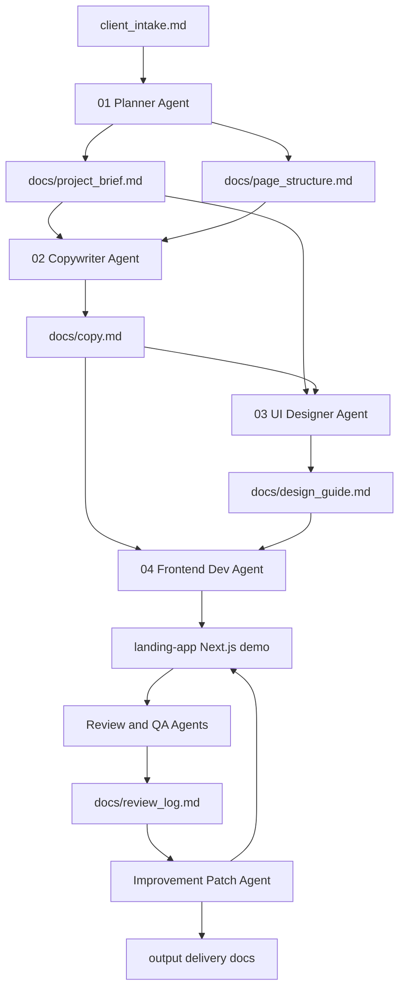
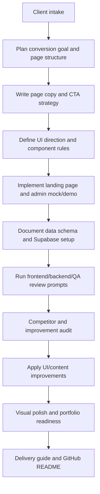
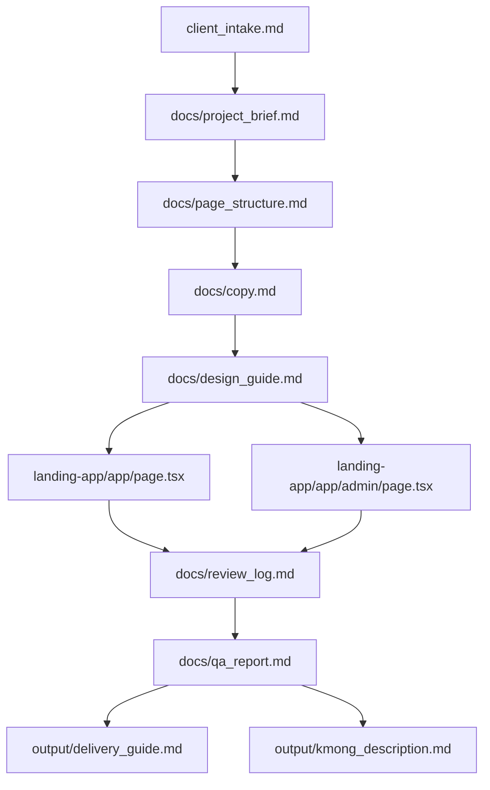
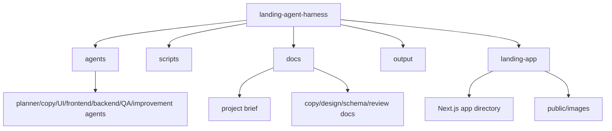

# Landing Agent Harness

A repeatable agent workflow for planning, building, reviewing, and polishing portfolio-ready landing page projects.

This repository is not only a single landing page. It is a harness: a set of role-specific agent prompts, project documents, review checklists, and a generated Next.js example app that demonstrate how a landing page can move from client intake to implementation, QA, and portfolio delivery.

> Current status: local workflow template plus a generated demo app. The included `landing-app/` project is an example output for a rental/lease consulting landing page and admin dashboard. Production hardening such as real admin authentication, strict permission design, and deployment-specific security review is **Future Work**.

## Overview

Landing Agent Harness structures landing-page creation as a staged agent process:

- collect client and project requirements
- plan page structure and conversion goals
- write landing-page copy
- create UI/design guidelines
- implement a Next.js landing page
- review frontend, backend, QA, and improvement passes
- package the result for GitHub portfolio presentation

The workflow is designed to make agent work repeatable instead of one-off. Each agent role reads prior outputs and writes a specific artifact.

## Motivation

Landing pages often fail because planning, copy, design, implementation, and QA happen out of order. This harness separates those responsibilities into clear agent steps so a project can be improved systematically and reviewed as a professional portfolio artifact.

## Key Features

- Role-specific agent prompt files under `agents/`
- Execution helper prompts under `scripts/`
- Planning, copy, design, database, QA, review, and delivery documents under `docs/`
- Generated Next.js landing-page example under `landing-app/`
- Supabase-oriented schema and setup notes for lead capture workflows
- Review and improvement stages for UI/content iteration
- Portfolio delivery materials under `output/`
- Clear separation between workflow documentation and generated app implementation

## Architecture



## Agent Workflow



## Data / Document Pipeline



## Directory Structure

```text
.
├── agents/              # Role-specific agent instructions
├── scripts/             # Short run prompts for each workflow stage
├── docs/                # Planning, copy, design, schema, QA, and review docs
├── templates/           # Reusable project templates, if added
├── output/              # Delivery notes and marketplace/portfolio text
├── landing-app/         # Generated Next.js example app
├── client_intake.md     # Starting intake document
├── project_brief.md     # Root-level scratch brief
├── README.md            # English project README
└── README.ko.md         # Korean project README
```



## Tech Stack

Harness:

- Markdown-based agent prompts
- Markdown project artifacts and review logs
- Mermaid diagrams for workflow documentation

Generated example app:

- Next.js
- React
- TypeScript
- Tailwind CSS
- Supabase client pattern for inquiry storage

## Usage

Use the harness from the repository root:

```powershell
cd landing-agent-harness
```

Recommended workflow:

1. Fill in or revise `client_intake.md`.
2. Run the planner prompt from `agents/01_planner.md`.
3. Use the copy, UI, frontend, backend, QA, and improvement prompts in order.
4. Keep each agent output in the matching `docs/` file.
5. Use `landing-app/` as the generated implementation workspace.
6. Review `output/delivery_guide.md` before portfolio delivery.

Run the generated app:

```powershell
cd landing-app
npm install
npm run dev
```

Open locally:

```text
http://localhost:3000
http://localhost:3000/admin
```

Build checks for the generated app:

```powershell
npm run lint
npm run build
```

## Example Use Cases

- Create a landing page from a client intake document
- Turn a rough service idea into a structured portfolio project
- Generate and review landing-page copy, UI direction, and implementation in separate passes
- Build a lead-capture landing page with an admin/dashboard demo
- Reuse the agent sequence for multiple landing-page projects

## Security / Privacy Notes

- Do not commit real client data, private lead data, credentials, access tokens, or production Supabase keys.
- Public Supabase anon keys may be used only with carefully designed RLS policies; service role keys must never be exposed in client code.
- The included admin page should be treated as a portfolio/demo surface unless real authentication and authorization are added.
- Replace placeholder business details before client delivery.
- Avoid publishing private URLs, local absolute paths, personal phone numbers, personal emails, and confidential client requirements.

During this README update, sensitive values were intentionally excluded: real Supabase project URLs, real API keys, tokens, service role keys, private client data, private URLs, personal contact details, and local absolute paths.

## Future Improvements

- **Planned:** Add a clean starter template for new landing projects.
- **Planned:** Add a checklist script that verifies required docs before implementation starts.
- **Planned:** Add example issue/PR templates for agent review cycles.
- **Future Work:** Add production-ready admin authentication guidance.
- **Future Work:** Add stricter Supabase RLS examples for real deployments.
- **Future Work:** Add automated visual regression and accessibility checks.
