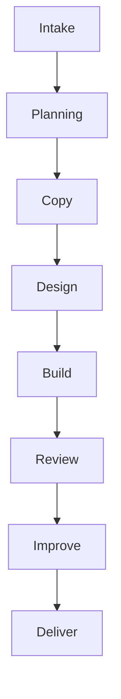
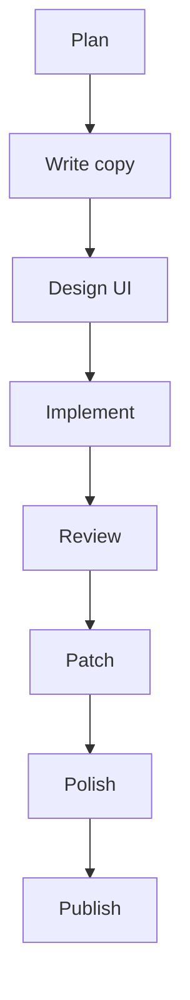
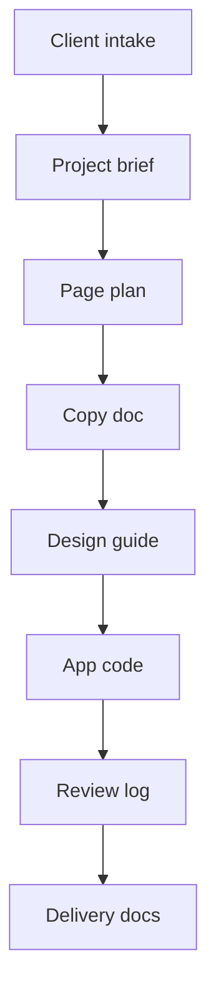
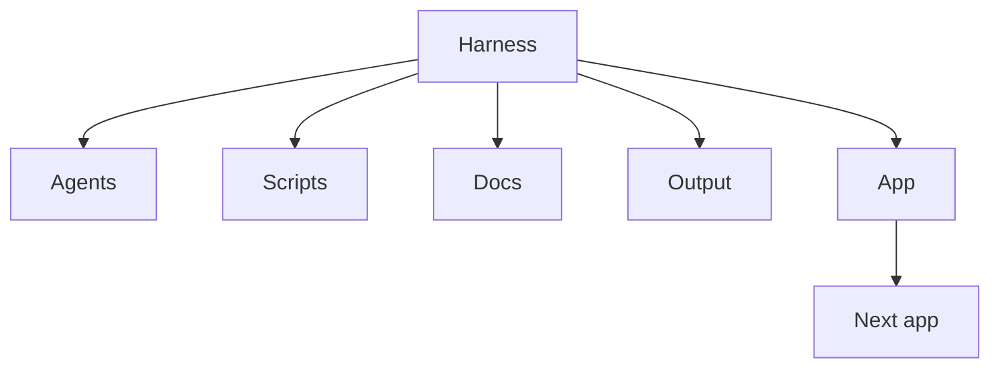

# Landing Agent Harness

A repeatable agent workflow for planning, building, reviewing, and polishing portfolio-ready landing page projects.

This repository is a harness, not just a single landing page. It contains role-specific agent prompts, project documents, review checklists, and a generated Next.js example app that show how a landing page can move from client intake to implementation, review, improvement, and GitHub portfolio delivery.

> Current status: local workflow template plus a generated demo app. The included `landing-app` project is an example output for a rental or lease consulting landing page and admin dashboard. Production hardening such as real admin authentication, strict authorization, and deployment security review is **Future Work**.

## Overview

Landing Agent Harness structures landing-page creation as a staged agent process:

- collect client and project requirements
- plan page structure and conversion goals
- write landing-page copy
- define UI and component direction
- implement a Next.js landing page
- review frontend, backend, QA, and improvement passes
- package the result for GitHub portfolio presentation

The workflow is designed to make agent work repeatable. Each agent reads previous outputs and writes a specific artifact for the next step.

## Motivation

Landing pages often become inconsistent when planning, copy, design, implementation, and QA happen out of order. This harness separates those responsibilities into clear agent steps so the project can be improved systematically and reviewed as a professional portfolio artifact.

## Key Features

- Role-specific agent prompt files
- Execution helper prompts
- Planning, copy, design, schema, QA, review, and delivery documents
- Generated Next.js landing-page example
- Supabase-oriented schema and setup notes for lead capture
- UI and content iteration through review stages
- Portfolio delivery materials
- Clear separation between workflow documentation and generated app implementation

## Architecture



Detailed paths are described in the Directory Structure section.

## Agent Workflow



The workflow is intended to support repeated landing-page creation. Planning, implementation, review, and UI/content iteration are kept as separate steps.

## Data and Document Pipeline



Detailed paths are described in the Directory Structure section.

## Directory Structure

```text
.
|-- agents/
|-- scripts/
|-- docs/
|-- templates/
|-- output/
|-- landing-app/
|-- client_intake.md
|-- project_brief.md
|-- README.md
`-- README.ko.md
```

Important folders:

- `agents/`: role-specific agent instructions.
- `scripts/`: short prompts for running each stage.
- `docs/`: planning, copy, design, schema, QA, and review documents.
- `landing-app/`: generated Next.js example app.
- `output/`: delivery guide and portfolio text.

## Module Relationships



Detailed paths are described in the Directory Structure section.

## Tech Stack

Harness:

- Markdown-based agent prompts
- Markdown project artifacts and review logs
- Mermaid diagrams for workflow documentation

Generated example app:

- Next.js
- React
- TypeScript
- Tailwind CSS
- Supabase client pattern

## Usage

Use the harness from the repository root:

```powershell
cd landing-agent-harness
```

Recommended workflow:

1. Fill in or revise `client_intake.md`.
2. Run the planner prompt.
3. Use the copy, UI, frontend, backend, QA, and improvement prompts in order.
4. Keep each agent output in the matching document under `docs`.
5. Use `landing-app` as the generated implementation workspace.
6. Review the delivery guide before portfolio delivery.

Run the generated app:

```powershell
cd landing-app
npm install
npm run dev
```

Open locally:

```text
http://localhost:3000
http://localhost:3000/admin
```

Build checks for the generated app:

```powershell
npm run lint
npm run build
```

## Example Use Cases

- Create a landing page from a client intake document.
- Turn a rough service idea into a structured portfolio project.
- Generate and review copy, UI direction, and implementation in separate passes.
- Build a lead-capture landing page with an admin dashboard demo.
- Reuse the same agent sequence for multiple landing-page projects.

## Security / Privacy Notes

- Do not commit real client data, private lead data, credentials, access tokens, or production Supabase keys.
- Public Supabase anon keys should be used only with carefully designed RLS policies.
- Service role keys must never be exposed in client code or public documentation.
- The included admin page should be treated as a portfolio/demo surface until real authentication and authorization are added.
- Replace placeholder business details before client delivery.
- Avoid publishing private URLs, local absolute paths, personal phone numbers, personal emails, and confidential client requirements.

No real Supabase project URLs, API keys, tokens, service role keys, private client data, private URLs, personal contact details, or local absolute paths are included in this README.

## Future Improvements

- **Planned:** Add a clean starter template for new landing projects.
- **Planned:** Add a checklist script that verifies required documents before implementation.
- **Planned:** Add issue and pull request templates for agent review cycles.
- **Future Work:** Add production-ready admin authentication guidance.
- **Future Work:** Add stricter Supabase RLS examples for real deployments.
- **Future Work:** Add automated visual regression and accessibility checks.
